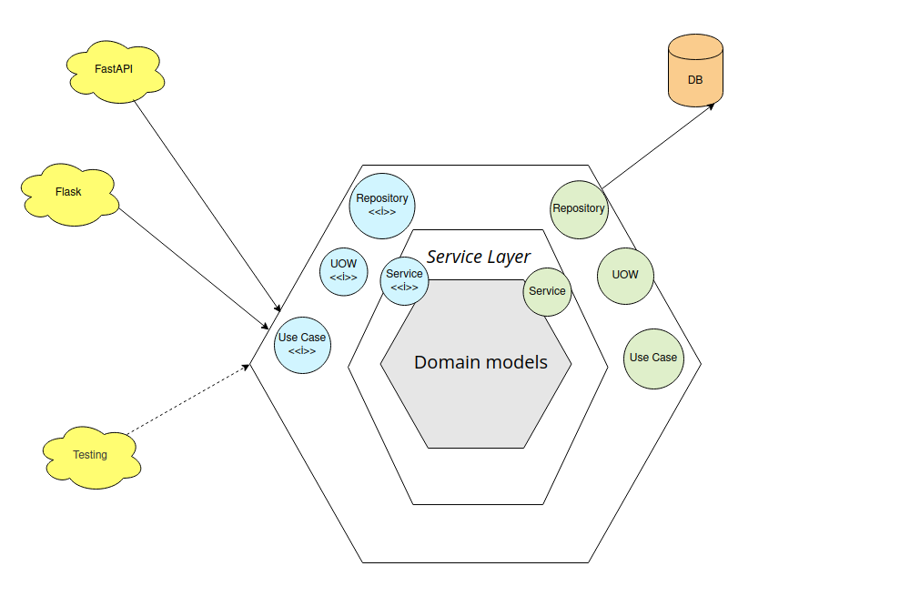
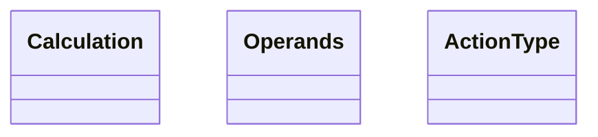
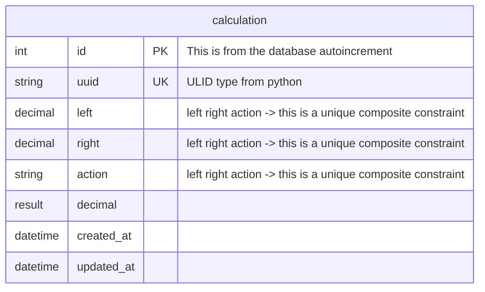
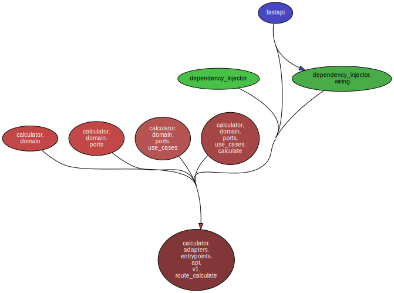
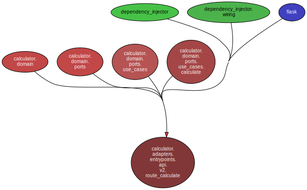
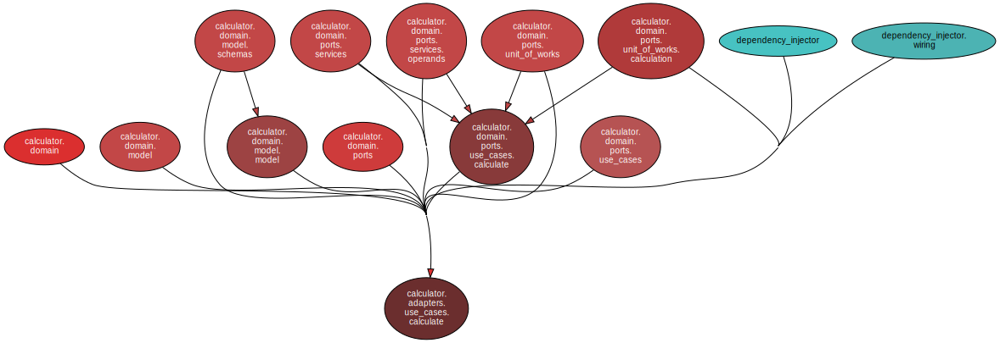

# Hexagonal Calculator

Calculator application using Hexagonal Architecture in Python.

Other patterns involved:

* Domain modelling
* Repository
* Unit of Work
* Services
* Use Cases

## How to install?

Use virtualenv as:

* `python3 -m venv .venv`
* `source .venv/bin/activate`

We use flit for the installation and package management:

Install flit:

* `pip install flit==3.7.1`

The rest of the commands can be found using `make help`:

```
---------------HELP-----------------
To install the project type -> make install
To install the project for development type -> make install-dev
To test the project type -> make test
To test with coverage -> make test-cov
To format code type -> make format
To check linter type -> make lint
To run type checker -> make type-check
To run all security related commands -> make secure
To create database migrations -> make migrations
To run database migrations -> make migrate
------------------------------------
```

For development purposes the main command is `make install-dev` as it will enable editable installation.

## How to run?

Our application has FastAPI and Flask support for the same functionality, as we have decoupled the business logic, frameworks are responsible only for showing the results.

* Start Flask development server:

`TEST_RUN=True flask --app src.calculator.adapters.entrypoints.api.app:flask_app run`

* Start FastAPI development server:

`TEST_RUN=True uvicorn src.calculator.adapters.entrypoints.api.app:app --port 8000`

## How to test?

For running all tests:

`make test`

For running only integration tests:

`TEST_RUN=True pytest -svv -m integration`

For running tests with coverage:

`make test-cov`

## Ports and Adapters layers




## Understanding Layers with classes

### Repositories + UOWs + Use Cases

```mermaid
classDiagram
    class CalculationRepositoryInterface {
        <<interface>>
        + add(self, calculation: model.Calculation) -> None
        + get(self, id_) -> model.Calculation
        + get_by_action(self, action: str) -> model.Calculation
        + get_by_uuid(self, uuid: str) -> model.Calculation
        + get_all(self) -> list[model.Calculation]
        
        _add(self, calculation: model.Calculation)* -> None
        _get(self, id_)* -> model.Calculation:
        _get_by_action(self, action: str)* -> model.Calculation
        _get_by_uuid(self, uuid: str)* -> model.Calculation
        _get_all(self)* -> list[model.Calculation]
        
    }
    
    class CalculationSqlAlchemyRepository {
        - _add(self, calculation: model.Calculation) -> None
        - _get(self, id_) -> model.Calculation:
        - _get_by_action(self, action: str) -> model.Calculation
        - _get_by_uuid(self, uuid: str) -> model.Calculation
        - _get_all(self) -> list[model.Calculation]
    }
    
    class CalculationUnitOfWorkInterface{
        <<interface>>
        + calculation: CalculationRepositoryInterface
    }
    
    class CalculationSqlAlchemyUnitOfWork{
        + calculation: CalculationRepositoryInterface
    }
    
    class CalculateUseCaseInterface{
        <<interface>>
        + add(self, left: Decimal, right: Decimal)
        + subtract(self, left: Decimal, right: Decimal)
        + multiply(self, left: Decimal, right: Decimal)
        + divide(self, left: Decimal, right: Decimal)
        + get_all(self)
        + get_by_uuid(self, uuid: str) -> dict[str, Any]
        
        __init__(self, uow: CalculationUnitOfWorkInterface, service: OperandsServiceInterface)*
        _add(self, left: Decimal, right: Decimal)*
        _subtract(self, left: Decimal, right: Decimal)*
        _multiply(self, left: Decimal, right: Decimal)*
        _divide(self, left: Decimal, right: Decimal)*
        _get_all(self)*
        _get_by_uuid(self, uuid: str)* -> dict[str, Any]
    }
    
    class CalculateUseCase{
        __init__(self, uow: CalculationUnitOfWorkInterface, service: OperandsServiceInterface)
        - _add(self, left: Decimal, right: Decimal)
        - _subtract(self, left: Decimal, right: Decimal)
        - _multiply(self, left: Decimal, right: Decimal)
        - _divide(self, left: Decimal, right: Decimal)
        - _get_all(self)
        - _get_by_uuid(self, uuid: str) -> dict[str, Any]
    }
    
    class OperandsServiceInterface{
        <<interface>>
        
        + add(self, left: Decimal, right: Decimal) -> Decimal
        + subtract(self, left: Decimal, right: Decimal) -> Decimal
        + multiply(self, left: Decimal, right: Decimal) -> Decimal
        + divide(self, left: Decimal, right: Decimal) -> Decimal
        
        _add(self, left: Decimal, right: Decimal)* -> Decimal
        _subtract(self, left: Decimal, right: Decimal)* -> Decimal
        _multiply(self, left: Decimal, right: Decimal)* -> Decimal
        _divide(self, left: Decimal, right: Decimal)* -> Decimal
    }
    
    class OperandsService{
        - _add(self, left: Decimal, right: Decimal) -> Decimal
        - _subtract(self, left: Decimal, right: Decimal) -> Decimal
        - _multiply(self, left: Decimal, right: Decimal) -> Decimal
        - _divide(self, left: Decimal, right: Decimal) -> Decimal
    }
        
    CalculationSqlAlchemyRepository ..|> CalculationRepositoryInterface: implements
    CalculationSqlAlchemyUnitOfWork ..|> CalculationUnitOfWorkInterface: implements
    CalculateUseCase ..|> CalculateUseCaseInterface: implements
    OperandsService ..|> OperandsServiceInterface: implements
    CalculationSqlAlchemyUnitOfWork ..> CalculationRepositoryInterface: depends on
    CalculateUseCase ..> CalculationUnitOfWorkInterface: depends on
    CalculateUseCase ..> OperandsServiceInterface: depends on
```




## Domain models

TODO: Update this section when you have Aggregates and relations



## Database Schemas



## Dependency Graphs

### Graph from FastAPI router

* The graph below is from FastAPI router. 
As you see use case is used by router and the framework itself is only responsible for routing.



### Graph from Flask router

* The graph below is from Flask router. 
Practically it is the same as FastAPI graph, again Flask is only responsible for routing.



### Graph from Use Case

* The graph below is from Use Case.



Why to analyze the dependency graphs? 
The rule I strongly advice to follow is: 

`"If it is hard to understand the dependency flow from the dependency graph, simply you are closer to have small to big ball of mud"`

If you have spotted something wrong here, just go back and try to simplify or fix the abstractions, dependencies, layers, etc.

## TODOs

* Use aggregates for atomic operations.
* Add more API endpoints for full calculator functionality.
* Increase test coverage.